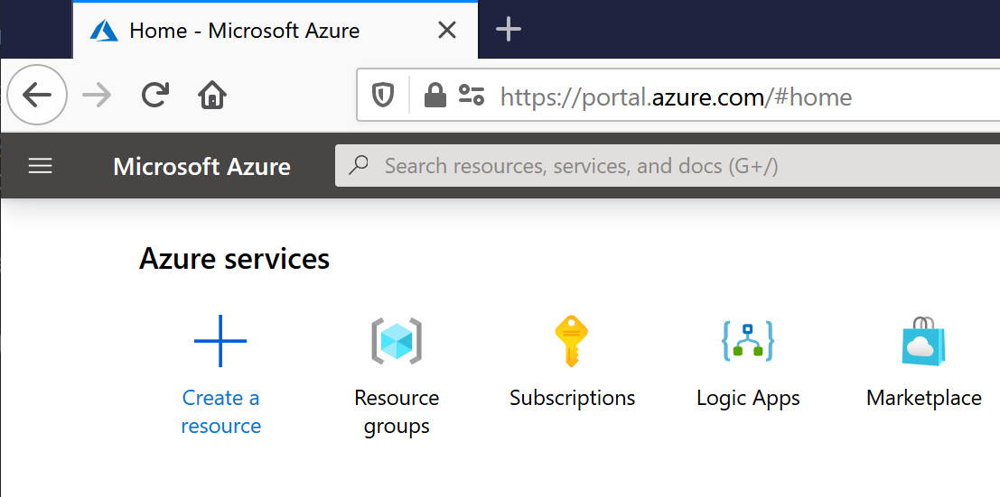
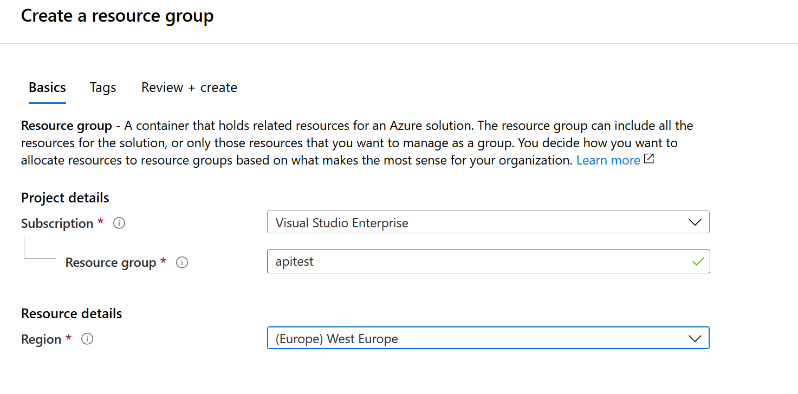
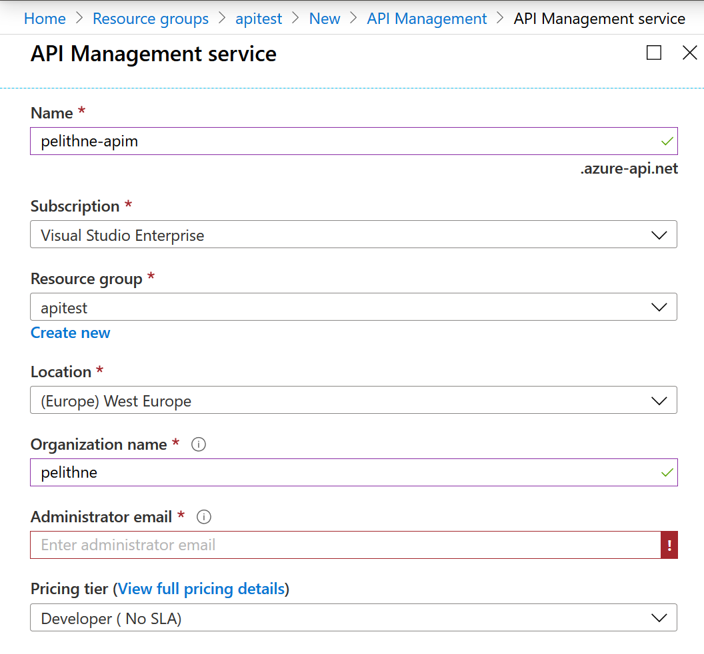
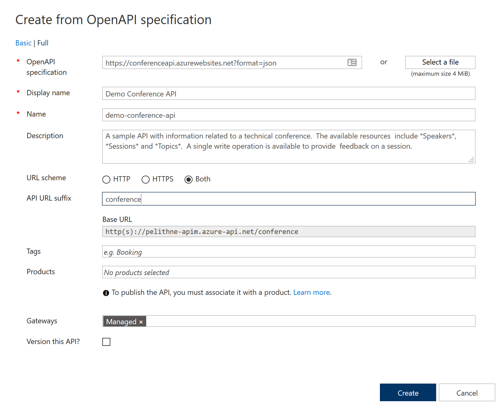
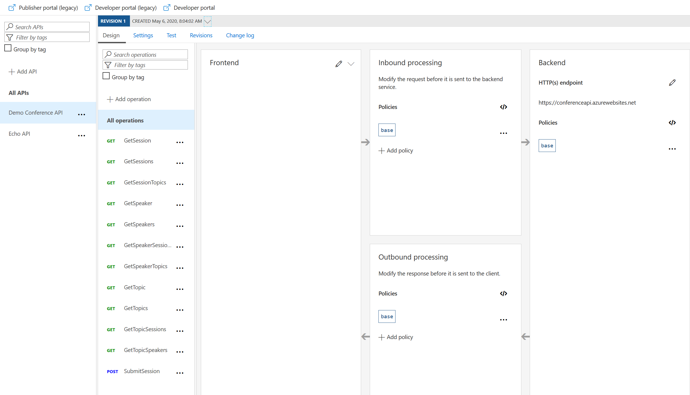
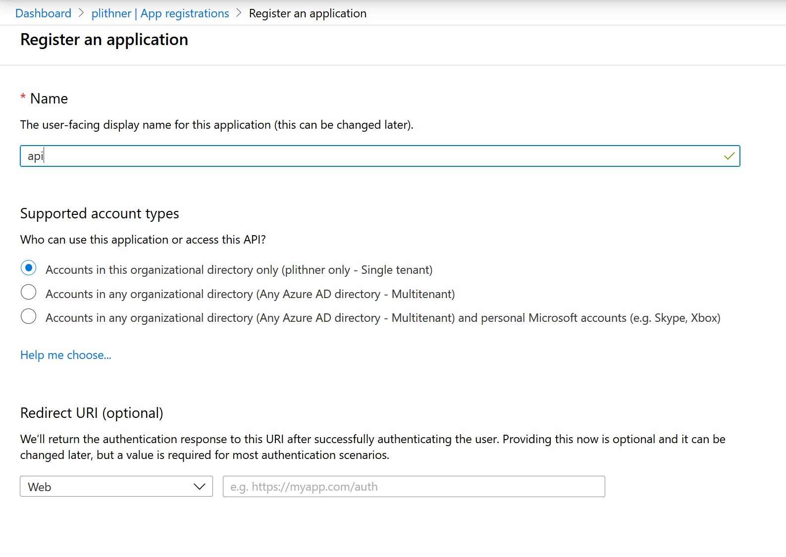
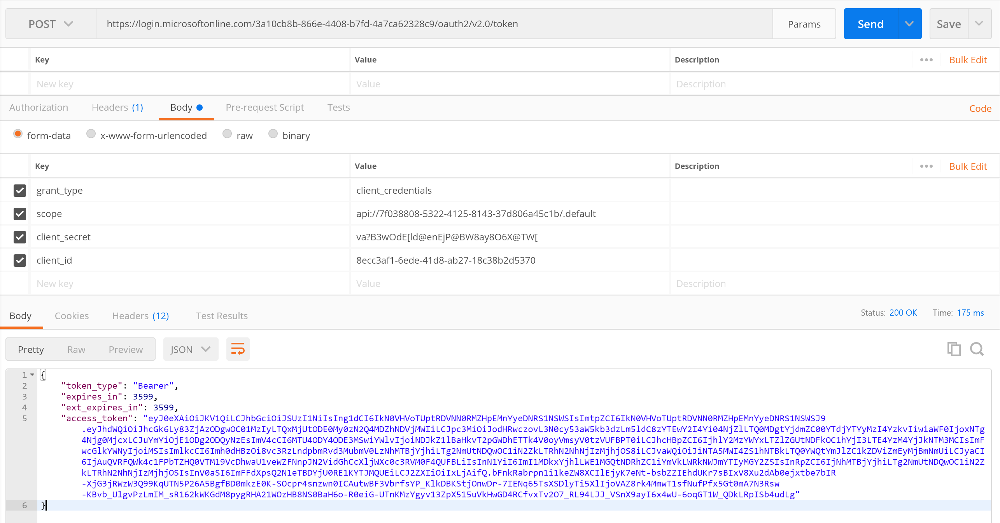
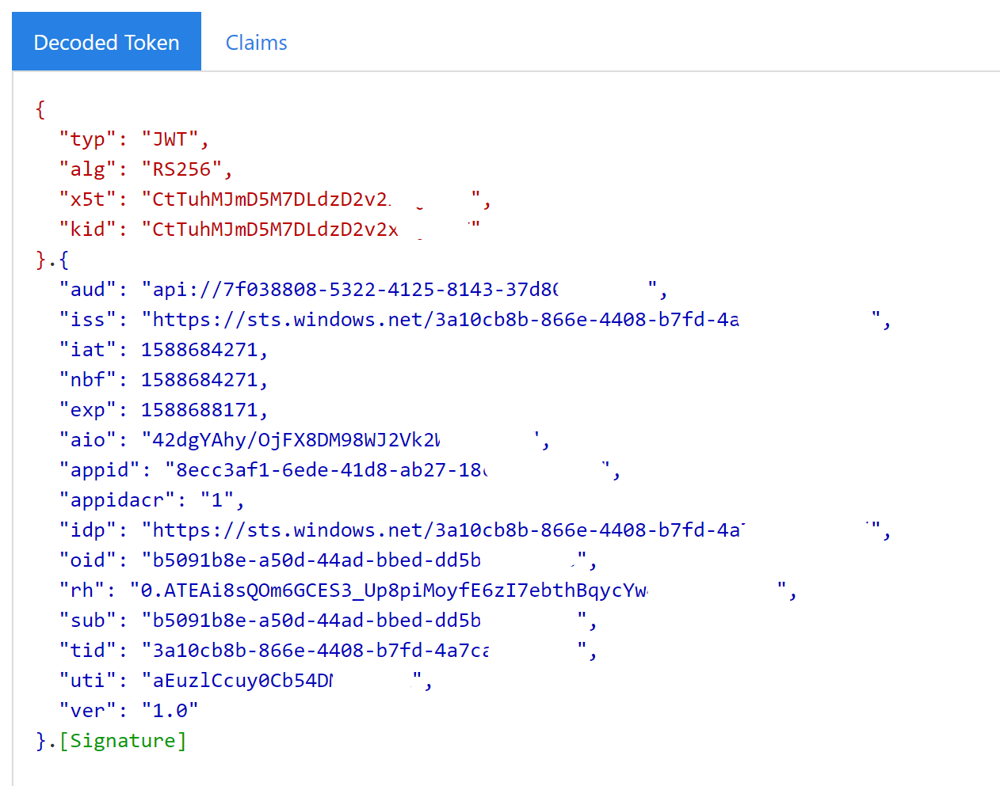
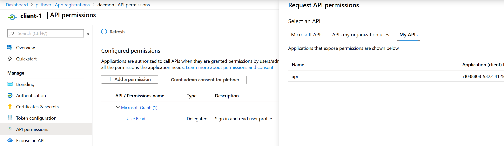
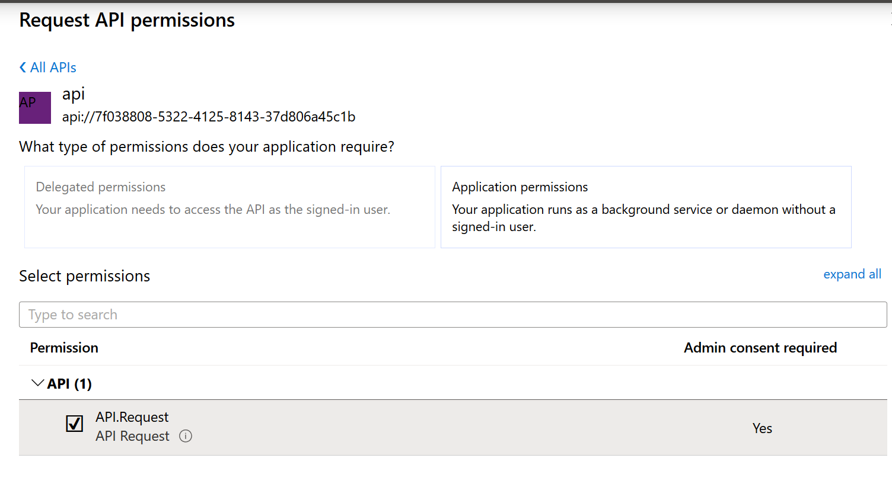

# daemon-to-apim-to-backend
This step-by-step describes how to setup a daemon app that sends requests via APIM to a REST API backend. 

The "architecture" for this tutorial case is something like the following

Automatic Daemon (With Azure Identity) -> APIM -> Backend REST API -> Operation 1
                                                                   -> Operation 2
                                                                   -> Operation n

Depending on the identity (or AD group) of the Daemon, the APIM will allow access to different parts of the backend API (different operations)

## Create a Resource Group

Start by logging in in to the Azure portal, and make sure you are in your "Home", https://portal.azure.com/#home

Click on "Create a Resource"

<p align="left">
  
</p>

In the search field, search for "Resource Group" and select Resource Group from the search results. Then click the "Create" button to start the creation of the Resource Group (RG). Give the RG a nice name, and make sure its placed in a Region close to you (actually the RG is just a placeholder, so the region doesn't really matter, but when you place resources in the RG they will be defaulted to the same region which makes things convenient).

<p align="left">
  
</p>

Then click review and create. Validation should pass, after which you can click on create.


## Create an API Manager instance

Azure API Manager, is a platform that can hold API definitions. The APIs are not hosted in APIM, instead it points to backend APIs, which could be running on Azure, on-prem, in another cloud or anywhere else you have connectivity to.

Start by going to your resource group, if you are not already there. Click on "Create Resources" (or "Add") and search for APIM in the search field. Select API Management from the search results, then click create.

Give your APIM a globally unique name. This is needed because the name will be used to create a URL that needs to be a Fully Qualified Domain Name, FQDN. 

Make sure that the APIM is located in the right subscription and in the resource group you just created. 

Add an "Organization name" of your choice and an "Administrator email". 

**Make sure** to use the "Developer" pricing tier. The developer tier gives you full functionality but without a Service Level Agreement, and is much cheaper than the other alternatives.

<p align="left">
  
</p>

Now wait. It can take a while to create the APIM instance, up to 40 minutes at the time of writing (May 2020)

## Create an API in APIM

This section has borrowed a lot from this tutorial: https://docs.microsoft.com/en-us/azure/api-management/import-and-publish#-import-and-publish-a-backend-api but I have made it a bit condensed. If unclear, feel free to go to the source for more details.

You will import an OpenAPI (formerly Swagger) Specification backend API in JSON format into APIM. The backend API is hosted at https://conferenceapi.azurewebsites.net?format=json.

Start by going to you APIM instance. In the left navigation of your API Management instance, select APIs from the API Management section.

Select the OpenAPI tile, and then select "Full" on the top left of the pop up screen (instead of basic, which is the default start screen).

Paste this URI into the "Open API Specification" field: https://conferenceapi.azurewebsites.net?format=json

This will import the API into APIM, and populate the other fields in the pop-up. You need to add an API URL suffix that will be used to reach the API that is published through APIM. You can call it anything, but I will call it "conference".

It should look like the following: 

<p align="left">
  
</p>

If all looks right, click "Create".

The new API will be imported, and you will see that API with all its operations, next to the Echo API which comes as a default with APIM. 

<p align="left">
  
</p>

## Create Application Registrations

Both the API and the Daemon needs to be registered in Azure AD, so that we can use Oauth2 for authentication. We start with the API.

Search for "App registrations" and select App Registrations from the search results. Name the registration appropriately and leave the defaults and click "Register".

<p align="left">
  
</p>


In the left hand navigation pane, go to "Expose an API", then click on "Application ID URI - Set", and leave the default value, which should look similar to ````api://7f038808-5322-4125-8143-12d804a45c1b````. The alphanumeric string is the clientID. **Make a note of this** as it will be needed later.

Now, create another app registration for the daemon. Give it a name, and leave the defaults then click "Register".

Now, we need to create a secret for the daemon. In the left hand navigation pane, go to "Certificate & Secrets", then select "New Client Secret". Give it a name and choose an expiration time (I use 1 year).

Copy the secret and store it safely. You will not be able to see it again in the portal.    

Also, make a note of the clientID, which can be found in the "Overview" from the left hand navigation pane.

Use e.g. postman to try if you get a response from your token endpoint. 

The URL to use is  https://login.microsoftonline.com/\<tenant id\>/oauth2/v2.0/token, and the method needs to be POST. 

You also need to add a few key value pairs in the body of the request (not query parameters).

* grant_type: should be ````client_credentials````
* scope: The application ID URI from above (similar to ````api://7f038808-5322-4125-8143-12d804a45c1b````)
* client_secret: The secret you save securely before (right?)
* client_id: The ClientID you saved above (similar to ````7f038808-5322-4125-8143-12d804a45c1b````)

<p align="left">
  
</p>

You should get a response similar to the (slightly redacted) output in the picture above.

If  you go to (for instance) jwt.ms you can decode the token and break it down to its parts. I should look something like this (except for the redacted parts):

<p align="left">
  
</p>

Where, for instance, "appid" corresponds to the app-registration of the daemon app.

## Granting Application Permissions to the deamon
You need to add application permissions to the API app-registration. This is required to enable OAuth 2.0 client credentials flow. 

Go to the API app registration you created previously, and edit its Manifest. You need to add an entry into the appRoles array specifying that the permission is for an application. For more info on this, feel free to have a look at https://docs.microsoft.com/en-us/azure/active-directory/develop/howto-add-app-roles-in-azure-ad-apps

The appRoles array should now look similar to the one below. 
````
      "appRoles": [
            {
                  "allowedMemberTypes": [
                        "Application"
                  ],
                  "description": "Allow client apps to send requests to the API.",
                  "displayName": "API Request",
                  "id": "cfef0000-0000-0000-be10-90e97fa573a6",
                  "isEnabled": true,
                  "lang": null,
                  "origin": "Application",
                  "value": "API.Request"
            }
      ]
````

The only thing you need to change is the GUID (id) value, and it needs to be a valid GUID (for guidance, look here https://docs.microsoft.com/en-us/powershell/module/microsoft.powershell.utility/new-guid?view=powershell-7 or search the web for a guid generator).

When you are done, click save.

Now, go to the app-registration of your daemon and select "API Permissions" in the left hand toolbar.

Click on Add a Permission, and find your API and select it.

<p align="left">
  
</p>

Select the role you added previously, e.g. !Request" and click on "Add permissions".

<p align="left">
  
</p>

Finally, when prompted, click on Click on Grant admin consent for \<your user name\>. This step requires Azure AD admin privileges. If you don't have it this will not work.


## Validate the Application Permissions in APIM
In the previous section we granted role-based access for the client application to call the API. Now we can use a policy in APIM to validate the roles claim. 

This makes sure that the token targets our API, and that the caller has the correct role-based access to the API.

The validation policy should look similar to the below.

````
    <inbound>
        <validate-jwt header-name="Authorization" failed-validation-httpcode="401" failed-validation-error-message="Unauthorized. Access token is missing or invalid.">
            <openid-config url="https://login.microsoftonline.com/de270000-0000-0000-84d2-000000d640cb/.well-known/openid-configuration" />
            <required-claims>
                <claim name="aud" match="any">
                    <value>api://80c40000-0000-4ef6-0000-0000d66eb2c9</value>
                    <value>80c40000-0000-4ef6-0000-0000d66eb2c9</value>
                </claim>
                <claim name="roles" match="any">
                    <value>API.Request</value>
                </claim>
            </required-claims>
        </validate-jwt>
        <return-response>
            <set-status code="200" />
            <set-header name="content-type" exists-action="override">
                <value>application/json</value>
            </set-header>
            <set-body>{
                "status": "200",
                "message": "OK"
            }</set-body>
        </return-response>
    </inbound>
````

## Try it out

Use postman (or similar) to try out the AD enforced API access, and the jwt validation.

We will use the default echo API, so the URL to use will be

````
https://\<your APIM\>.azure-api.net/echo
````


## Create the Daemon

TBD. Postman will have to do for now... 

##


## Create Azure Function backend API

