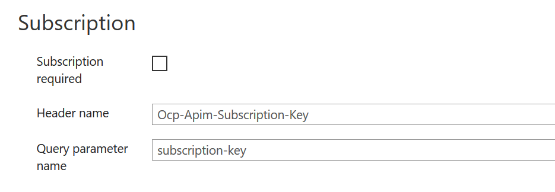
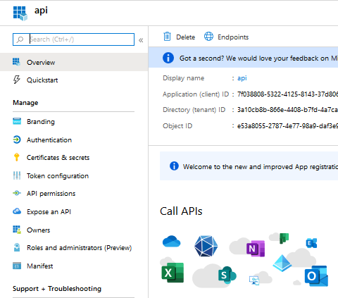
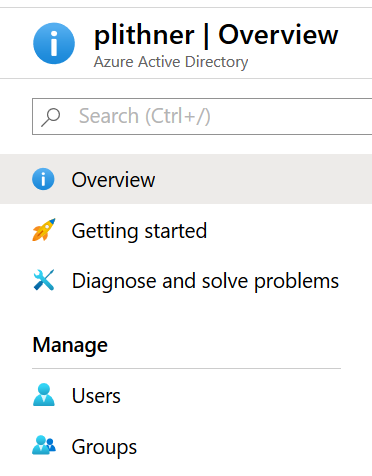
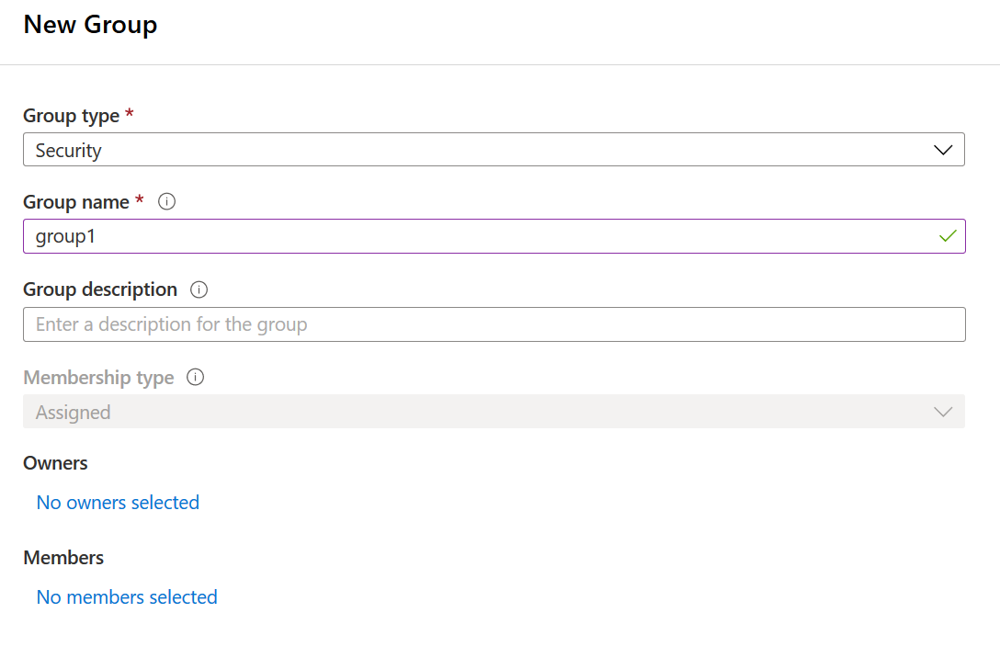

# Client Credentials flow with APIM

This step-by-step guide describes how to setup a Client app that sends requests via APIM to a REST API backend. 

Authentication of the Clients is controlled by Oauth Client Credentials flow, using Azure Active Directory and policies in Azure API Management.

The "architecture" for this tutorial case is something like the following

* Automatic Client 1 -> APIM -> Backend REST API -> Operation 1, Operation 2
* Automatic Client 2 -> APIM -> Backend REST API -> Operation 2
* Automatic Client x -> APIM -> Backend REST API -> Operation y

Depending on the identity (or AD group) of the Client, the APIM will allow access to different parts of the backend API.

For simplicity, the Client is represented by REST calls from Postman (or similar) but if you want to write a real application no one is stopping you :-) 

## Create a Resource Group

Start by logging in in to the Azure portal, and make sure you are in your "Home", https://portal.azure.com/#home

Click on "Create a Resource"

<p align="left">
  
</p>

In the search field, search for "Resource Group" and select Resource Group from the search results. Then click the "Create" button to start the creation of the Resource Group (RG). Give the RG a nice name, and make sure its placed in a Region close to you (actually the RG is just a placeholder, so the region doesn't really matter, but when you place resources in the RG they will be defaulted to the same region which makes things convenient).

<p align="left">
  
</p>

Then click review and create. Validation should pass, after which you can click on create.


## Create an API Manager instance

Azure API Manager, is a platform that can hold API definitions. The APIs are not hosted in APIM, instead it points to backend APIs, which could be running on Azure, on-prem, in another cloud or anywhere else you have connectivity to.

Start by going to your resource group, if you are not already there. Click on "Create Resources" (or "Add") and search for APIM in the search field. Select API Management from the search results, then click create.

Give your APIM a globally unique name. This is needed because the name will be used to create a URL that needs to be a Fully Qualified Domain Name, FQDN.

Make sure that the APIM is located in the right subscription and in the resource group you just created.

Add an "Organization name" of your choice and an "Administrator email".

**Make sure** to use either the "Consumption" or "Developer" or pricing tier. The developer tier gives you full functionality but without a Service Level Agreement, and is much cheaper than "Basic", "Standard" or "Premium". The consumption tier has some feature restrictions, but is only charged per transaction (plus, the first 1 000 000 transactions are free). Also it starts much quicker than the other tiers.

<p align="left">
  
</p>

Now wait. It can take a while to create the APIM instance, up to 40 minutes at the time of writing (May 2020)

## Create an API in APIM

This section has borrowed a lot from this tutorial: https://docs.microsoft.com/en-us/azure/api-management/import-and-publish#-import-and-publish-a-backend-api but a bit more condensed. If unclear, feel free to go to the source for more details.

You will import an OpenAPI (formerly Swagger) Specification backend API in JSON format into APIM. The backend API is hosted at https://conferenceapi.azurewebsites.net?format=json.

Go to your APIM instance. In the left navigation of your API Management instance, select APIs from the API Management section.

Select the OpenAPI tile, and then select "Full" on the top left of the pop up screen (instead of basic, which is the default start screen).

Paste this URI into the "Open API Specification" field: https://conferenceapi.azurewebsites.net?format=json

This will import the API into APIM, and populate the other fields in the pop-up. You need to add an API URL suffix that will be used to reach the API that is published through APIM. You can call it anything, but I will call it "conference".

It should look like the following: 

<p align="left">
  
</p>

If all looks right, click "Create".

The new API will be imported, and you will see that API with all its operations (GetSession, GetSessions, GetSpeaker, etc). 

<p align="left">
  
</p>

For simplicity, go into the settings of the API and uncheck the box named "Subscription required". This is to remove the need to send in a subscription key with every request (we will implement authentication/authorization in a different way).

<p align="left">
  
</p>

To try the new API out, you can send a request to ````https://\<your APIM\>.azure-api.net/conference/speakers````. This will call one of the operations of the API, named GetSpeakers.

You can use a browser for this, or curl or postman or whatever is your preference. The response should be a list of people, "speakers".

You will work more with the API operations later (adding policies etc).

## Create Application Registrations

Both the API and the Clients need to be registered in Azure AD, so that we can use Oauth2 for authentication. During this process you will end up with a few IDs and secrets, which you need to keep track of. I suggest creating a text file to store these (but remember to never store secrets in plain text for anything even resembling production!).

### API Application Registration

Search for "App registrations" and select App Registrations from the search results. Name the registration appropriately and leave the defaults and click "Register".

<p align="left">
  
</p>

In the left hand navigation pane, go to "Expose an API", then click on "Application ID URI - Set", and leave the default value, which should look similar to ````api://7f038808-5322-4125-8143-12d804a45c1b````. The alphanumeric string is the clientID. Make a note of this as it will be needed later (you can of course navigate back to this place and retrieve this value).

### Client-1 Application Registration

Create another app registration for the first Client. Give it a name (why not "Client-1"), and leave the defaults then click "Register".

Next,  create a secret for the Client. In the left hand navigation pane, go to "Certificate & Secrets", then select "New Client Secret". Give it a name and choose an expiration time (for instance, 1 year).

**Copy the secret and store it safely**. You will not be able to see it again in the portal.

Also, make a note of the clientID, which can be found in the "Overview" from the left hand navigation pane.

### Client-2 Application Registration

Repeat the steps for Client-1, and give it a different name ("Client-2"!)


## Get the Access Token

Use e.g. Postman to try if you get a response from your token endpoint. Lets use Client-1 to begin with.

The URL to use is  https://login.microsoftonline.com/\<tenant id\>/oauth2/v2.0/token, and the method needs to be POST. 

You also need to add a few key value pairs in the body of the request (not query parameters). Have a look at the screen dump below to see how to input this into Postman.

* grant_type: should be ````client_credentials````
* scope: The application ID URI for the API plus a path (similar to ````api://7f038808-5322-4125-8143-12d804a45c1b/.default````)
* client_secret: The secret for Client-1 that you save securely before (right?)
* client_id: The ClientID for Client-1 that you saved above (similar to ````8ecc3af1-6ede-41d8-ab27-12338b2d5123````)

<p align="left">
  
</p>

After pressing **Send** you should get a response similar to the (slightly redacted) output in the picture above.

If you go to jwt.ms and paste in the "access token", you can decode the token and break it down to its parts. I should look something like below (except for the redacted parts). This is not needed, just a "good to know".

<p align="left">
  
</p>

Where, for instance, "appid" will correspond to the app-registration Client ID of the Client app.

## Granting Application Permissions to the clients
You need to add application permissions to the API app-registration. This is required to enable OAuth 2.0 client credentials flow, so that the Client applications are allowed to use the API.

Go to the API app registration you created previously, and edit its Manifest. You will find this in the left hand navigation pane of the API app registration blade

<p align="left">
  
</p>


You need to add an entry into the appRoles array specifying that the permission is for an application. For more info on this, feel free to have a look at https://docs.microsoft.com/en-us/azure/active-directory/develop/howto-add-app-roles-in-azure-ad-apps

The appRoles array is empty to begin with and you need to add the following:

````
      "appRoles": [
            {
                  "allowedMemberTypes": [
                        "Application"
                  ],
                  "description": "Allow client apps to send requests to the API.",
                  "displayName": "API Request",
                  "id": "cfef0000-0000-0000-be10-90e97fa573a6",
                  "isEnabled": true,
                  "lang": null,
                  "origin": "Application",
                  "value": "API.Request"
            }
      ]
````

The only thing you need to change is the GUID (id) value, and it needs to be a valid GUID (for guidance, look here https://docs.microsoft.com/en-us/powershell/module/microsoft.powershell.utility/new-guid?view=powershell-7 or search the web for a guid generator).

When you are done, click save.

Now, go to the app-registration of your respective Clients and select "API Permissions" in the left hand toolbar.

Click on Add a Permission, find your API and select it.

<p align="left">
  
</p>

Select the role you added previously, e.g. "Request" and click on "Add permissions".

<p align="left">
  
</p>

Finally, when prompted, click on Click on Grant admin consent for \<your user name\>. This step requires Azure AD admin privileges. If you don't have it this will not work.


## Validate the Application Permissions in APIM
In the previous section we granted the client applications rights to call the API. Now we can use a policy in APIM to validate the roles claim.

Go to the the API we imported before (conference API), and click on "all operations". Then select "Edit policy" by clicking on the tiny **\<\/\>** "logo" to the far right.

Replace the entire inbound clause with the policy below, after changing the following values:

 * openid-config url: Replace the GUID with your Tenant ID
 * claim name="aud": Replace the value with your API app registration id
 * claim name="appid": Replace the value with your Client apps registration ids

````
    <inbound>
        <validate-jwt header-name="Authorization" failed-validation-httpcode="401" failed-validation-error-message="Unauthorized. Access token is missing or invalid.">
            <openid-config url="https://login.microsoftonline.com/3a10cb8b-866e-1231-b7fd-4a7ca62328c9/.well-known/openid-configuration" />
            <required-claims>
                <claim name="aud" match="any">
                    <value>api://7f038808-5322-4125-8143-123806a45123</value>
                </claim>
                <claim name="appid" match="any">
                    <value>8ecc3af1-6ede-41d8-ab27-12338b2d5123</value>
                    <value>8ecc3af1-6ede-41d8-ab27-12338b2d5124</value>
                </claim>
                <claim name="roles" match="any">
                    <value>API.Request</value>
                </claim>
            </required-claims>
        </validate-jwt>
    </inbound>
````

What this policy will do, is to 

* Evaluate that the "Audience" is correct. In other words, we make sure that the token targets our API.
* Evaluate that the appids are correct. In other words, we make sure that the user is allowed to use the API
* Evaluate that the role "API.Request" had the correct RBAC permissions to use the API.

## Try it out

You have already used postman (or similar, like Insomnia) to get the Access Token for e.g. Client-1

<p align="left">
  
</p>

Now, send a request to an operation in the newly created API. In the example below the request is sent to the "GetSpeakers" operation, but you can use any of the operations since the policy is written on the API-level Rather than on operation level.

The URL to use will look similar to this:

````
https://\<your APIM\>.azure-api.net/conference/speakers
````
In order for this all to work, you also need to add the Access token (for Client-1) as a header in the request.

## Validate AD group membership

To enable more centralized control over access to backend APIs, AD groups can be used. In order to demonstrate this a new group will be created in your AD. Search for "AD" and select "Azure Active Directory" from the search results.

From the left hand navigation bar, select "Groups" 

<p align="left">
  
</p>

Then create a new group and give it a name, and click "no members selected" to add new members to the group

<p align="left">
  
</p>

Add Client-1 app registrations to the group and click select. Then click Create.

We will use the group id, to create another claim in the API policy, so save it (or make sure you know how to navigate back to it).

Go to your APIM instance, and navigate to APIs and then the imported "Demo Conference API". Once again, click "All operations".

Edit the policy by clicking "validate-jwt" in the inbound processing box, then add the new claim by adding the claim below, but using the group id of the group you just created. You should place it at the same level as the other claims, between \<required-claims\> and \<\/required-claims\>

````
<claim name="groups" match="any">
    <value><Group ID></value>
</claim>
````

Finally, you need to edit the manifest of the API app registration again, to change this:

````
"groupMembershipClaims": null,
````

To this:
````
"groupMembershipClaims": "All",
````


Now try to access the API with the Client which you included in the group. The result should be as before.

If instead you try to access the API with the other Client, the request will be rejected.

## Extra assignment!

Use the tools and processes above to restrict usage on Operation level instead of API level. For example, give Client-1 access to GetSessions and GetSpeakers, while Client-2 only gets access to GetSpeakers.