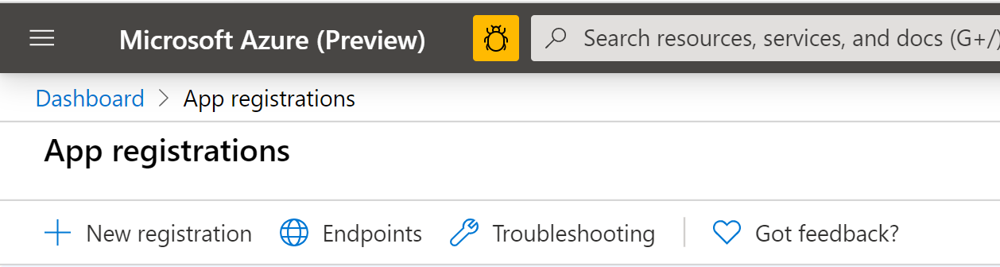

# daemon-to-apim-to-backend
THis Stephby-step describes how to setup a daemon app that sends requests via APIM to a REST API backend. 

The "architecture" for this tutorial case is something like the following

Automatic Daemon (With Azure Identity) -> APIM -> Backend REST API -> Operation 1
                                                                   -> Operation 2
                                                                   -> Operation n

Depending on the identity of the Daemon, the APIM will allow access to different parts of the backend API (different operations)

## Create a Resource Group

Start by log in in to the Azure portal, and make sure you are in your "Home", https://portal.azure.com/#home

Click on "Create a Resource"

  

In the search field, search for "Resource Group" and select Resource Group from the search results. Then click the "Create" button to start the creation of the Resource Group (RG). Give the RG a nice name, and make sure its placed in a Region close to you.

  

Then click review and create. Validation should pass, after which you can click on create.

## Create an API with APIM

Azure API Manager, is a platform that can host API definitions. The actual APIs are not hosted in APIM, instead it points to backend APIs, which could be running on Azure, on-prem, in another cloud or anywhere else you have connectivity to.

Start by going to your resource group, if you are not already there. Click on "Create Resources" (or "Add") and search for APIM in the search field. Select API Management from the search results, then click create.

Give your APIM a globally unique name. This is needed because the name will be used to create a URL that needs to be a Fully Qualified Domain Name, FQDN. 

Make sure that the APIM is located in the right subscription and in the resource group you just created. 

Add an "Organization name" of your choice and an "Administrator email". 

**Make sure** to use the "Developer" pricing tier. The developer tier gives you full functionality but without a Service Level Agreement, and is much cheaper than the other alternatives.

  

Now wait. It can take a while to create the APIM instance, up to 40 minutes at the time of writing (May 2020)

## Create the Daemon
The Daemon app will be a simple Python-thingy that authenticates towards Azure AD using the client credentials flow (https://docs.microsoft.com/en-us/azure/active-directory/develop/v2-oauth2-client-creds-grant-flow)

In order for the Daemon to get an identity, you need to register it in Azure AD. For background information about this, feel free to have a look at this page: https://docs.microsoft.com/en-us/azure/active-directory/develop/scenario-daemon-app-registration

First, search for "App Registrations" in the search bar, and select "App Registrations". The click in the plus-sign to the left to add a new Registration

  

Give the app a name (I called it daemon-app), select the single tenant account type and click on the "Register" button (There is no need for a Redict URI, since we will only be using the the client credentials flow which does not involve any call-back).

  

Next, use the left hand navigation pane to go to **API Permissions**, then select "Add a permission"

  

